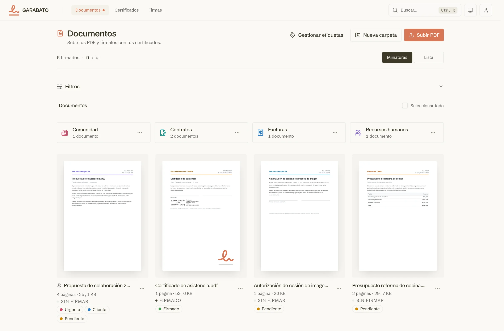
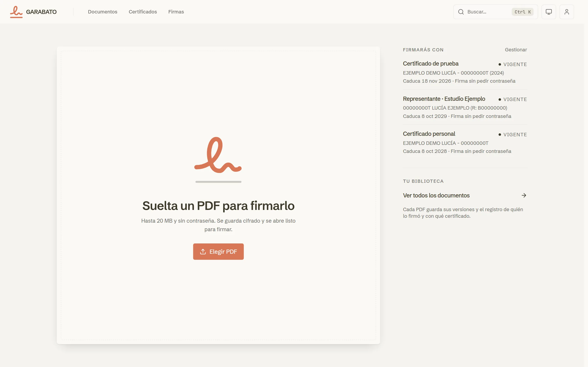
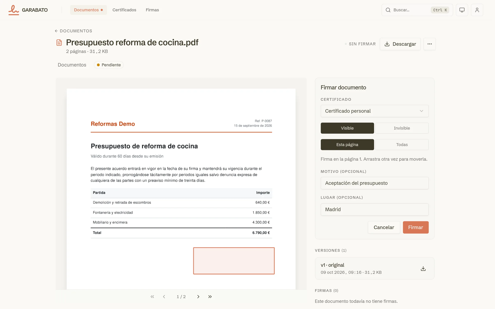
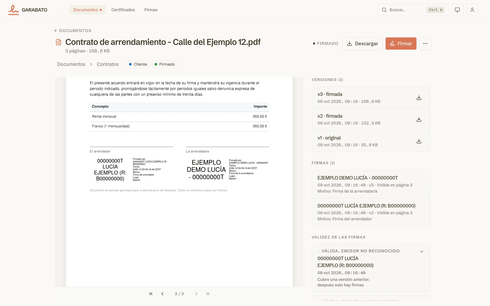
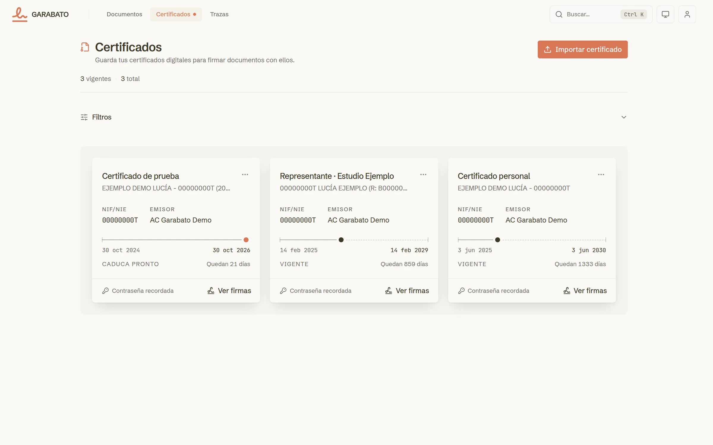
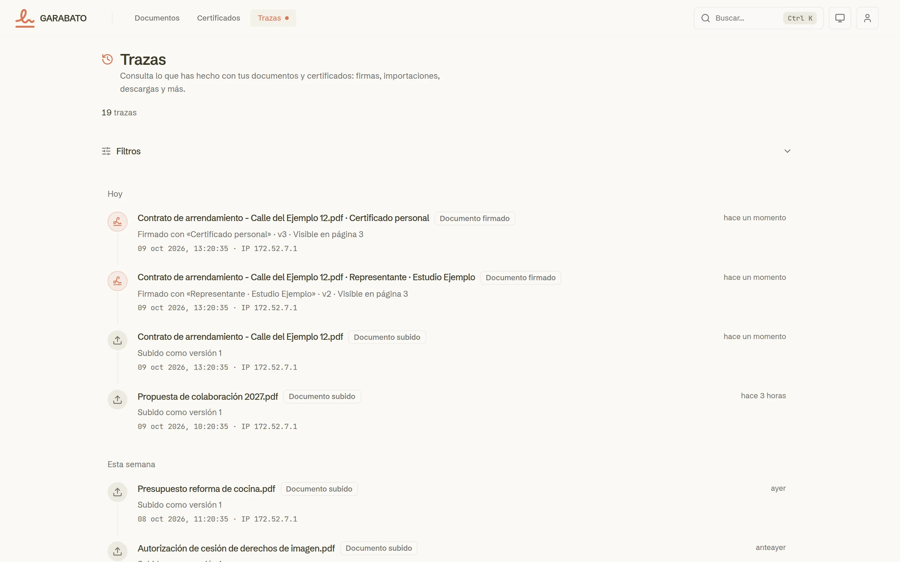
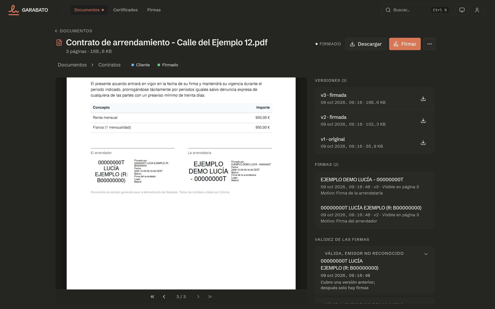
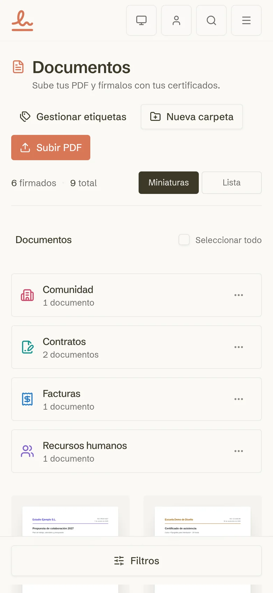
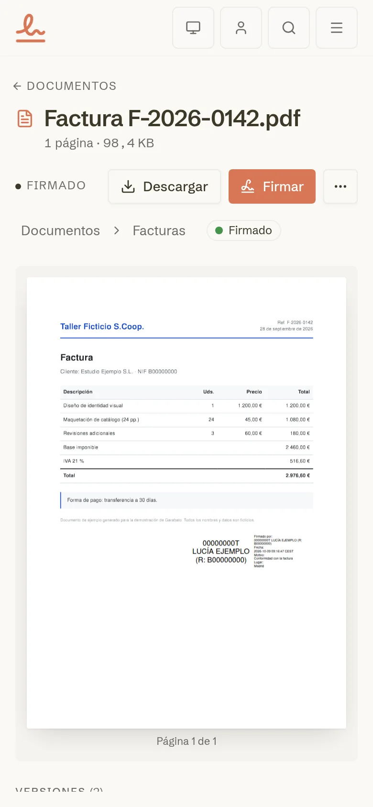

# Garabato

Sign PDFs with your own digital certificates. Drop a file on the home page,
place the visible signature, sign and download. Certificates are stored
encrypted, and the PDFs live encrypted in object storage.

Garabato is built on the `stack` template: a Turborepo monorepo with an Astro
frontend and a Hono/oRPC backend (TypeScript, Bun) behind a Caddy gateway, on
PostgreSQL. It keeps the template's packages (`@nonete/*`), conventions and
visual system, so code can move between the two repos unchanged. The
foundation that came with the template (auth, admin panel, typed API, cron
scheduler, comments, entity icons, activity log, Docker) is still here; the
product on top of it is document signing.

The project website, with the docs in English and Spanish, is at
[nonetss.github.io/garabato](https://nonetss.github.io/garabato/) (`apps/site`).

The code is in English; the UI copy and the API error messages users see are
in Spanish.

<picture>
  <source media="(prefers-color-scheme: dark)" srcset="doc/screenshots/documents-dark.webp">
  
</picture>

## Screenshots

All the data in these captures is made up: a demo account, self-signed test
certificates issued by a throwaway CA and generated PDFs.

**Drop a PDF to sign it.** The home page is a drop zone, next to the
certificates you will sign with.



**Place the signature and sign.** Pick a certificate, choose a visible or
invisible signature, drag a rectangle on the page and add an optional reason
and place.



**Every signature is a new version.** The viewer shows the visible stamps,
the version history (each one downloadable) and who signed with which
certificate. Signatures are PAdES B-B; with a time-stamping authority set in
`TSA_URL` they carry an RFC 3161 timestamp and reach B-T, which proves when
the document was signed.

**Fix the pages before signing.** "Editar páginas" reorders (by dragging or
with the move buttons), rotates and removes pages, and saves the result as the
next version; earlier versions stay downloadable. From the library, selecting
two or more documents offers "Unir en un PDF", which joins them in the chosen
order into a new document and leaves the sources untouched. Both refuse a
document that carries signatures, since rewriting it would invalidate them.

**Signature validity.** The document page checks every signature embedded in
the PDF, also those made with other tools before uploading: integrity, the
cryptographic signature, what it covers, the certificate's validity at the
signing time and whether its issuer chains to a trusted root (the Mozilla
store plus the FNMT and DNIe roots). Revocation is not checked.

<picture>
  <source media="(prefers-color-scheme: dark)" srcset="doc/screenshots/viewer-dark.webp">
  
</picture>

**Certificates** are imported from PKCS#12 files and stored encrypted, with
their validity at a glance.



**The signature log** lists every signature with its certificate, version and
placement, filterable by certificate, document name and dates.



**Dark theme and mobile.** Light, dark or system theme, and a layout that
works on a phone.

<p>
  
  
  
</p>

## How it fits together


- **One origin.** The gateway serves the site and the API from the same host,
  so the browser never makes cross-origin calls and session cookies just work.
  It is the only place that maps paths to apps; a new public route goes in
  `apps/gateway/routes.caddy` (shared by the production `Caddyfile` and the
  dev `Caddyfile.dev`), never as a published port on another service.
- **In dev, the gateway serves `https://localhost:4321`** over HTTP/2 with a
  local certificate, in front of `astro dev` on `:4320`, so dev routes exactly
  like production and Vite's many unbundled modules share one connection.
- **The backend owns the database.** On startup it applies the committed
  migrations, seeds the admin user and starts the cron scheduler.
- **Documents live in object storage.** PDFs and certificate material are
  encrypted before they are written. The store is any S3-compatible endpoint
  (`S3_*` in `.env`), or the bundled MinIO.
- **Shared packages are raw TypeScript.** `packages/*` have no build step;
  apps import their source directly.

## Features

- **Document signing**: a PDF library with thumbnails (`/documents`),
  organized in nested folders (with their own icon), colored tags and pinned
  documents, searchable and filterable across the whole library, with
  multi-selection, drag-and-drop moves and merging into one PDF; a viewer
  that places the visible signature, edits the pages (reorder, rotate,
  remove) into a new version, versions labelled by origin and a signature
  history (`/documents/[id]`), and digital certificates stored encrypted
  (`/certificates`), and a log of every signature with its certificate,
  hashes and filters (`/signatures`). The home page (`/`) is a drop zone that
  opens the document ready to sign
- **Astro + TailwindCSS**: SSR frontend with React islands and shadcn/ui (`base-nova` on Base UI), light/dark/system theme
- **Hono + oRPC**: type-safe RPC and OpenAPI endpoints (`/rpc/v1`, `/api/v1`), versioned routing, CSRF protection, admin-only API docs at `/scalar`
- **Better Auth**: email/password (plus optional OIDC), sessions, global admin role, organizations and teams with access control, API keys
- **Drizzle + PostgreSQL**: schema per domain; committed migrations applied automatically when the backend starts
- **Cron scheduler**: persistent jobs that run cron-eligible API procedures. The pages stay at `/crons`, out of the navbar, the home page and the search, for later use
- **Comments and entity icons**: threaded comments and custom icons over any resource
- **Activity log**: pino logs shipped to Loki and browsable at `/admin/logs`
- **PWA**: installable, with a web manifest and a service worker
- **Bun + Turborepo**: package manager and monorepo task runner
- **Biome**: linting and formatting
- **OpenSpec** (`openspec/`): spec-driven documentation of every capability

## What's in the app

Every page except login and signup requires a session.

| Route | What it is |
|---|---|
| `/` | Drop a PDF and open it ready to sign |
| `/documents`, `/documents/[id]` | The library (folders, tags, pins, search, multi-selection, merge into one PDF), then the viewer: edit the pages, place the signature, sign, versions and signature history |
| `/certificates` | Import and keep the digital certificates used to sign |
| `/signatures` | The signature log: every signature, filtered by certificate, document name and dates, with each record's full detail |
| `/login`, `/signup` | Sign in and create an account (email/password, plus OIDC when configured) |
| `/me` | The signed-in user's account: name, email, role, changing the name and password |
| `/config/profile`, `/config/appearance` | Profile settings and theme |
| `/crons`, `/crons/[id]` | Cron jobs, kept and reachable by URL, out of the navbar and the search |
| `/admin/*` | Admin only: users, sessions, organizations, teams, API keys, Better Auth plugins and the activity log |
| `/scalar` | Interactive API docs (admin session) |

The navbar search (`⌘K` / `Ctrl+K`) jumps to any page in the navigation and,
once you type, to individual documents.

## The API

`packages/api` holds the oRPC router, mounted by the backend twice:

- **`/rpc/v1/...`**: the RPC protocol the frontend uses through its typed
  client (`orpc.v1.<feature>.<method>()`). Reads go out as `QUERY`, writes as
  `POST`.
- **`/api/v1/...`**: the same procedures as plain HTTP (OpenAPI), for scripts
  and other services. The document is at `/openapi.json` and the docs at
  `/scalar`.

Each feature lives in `packages/api/src/v1/<feature>/` split into `input.ts`,
`output.ts`, `handler.ts` and `router.ts`. The v1 features are `health`,
`document`, `documentFolder`, `documentTag`, `certificate`, `private`, `authConfig`, `apiKey`, `organization`,
`plugins`, `sessionHistory`, `logs`, `cron`, `comment` and `entityIcon`.

Every procedure is built from one of five builders, which decide who may call
it: `publicProcedure`, `protectedProcedure` (any signed-in user),
`adminProcedure` (global `admin` role), `permissionProcedure` (an
organization permission) and `cronProcedure` (only the scheduler, never over
HTTP). Callers authenticate with the session cookie, a Bearer token or an
`x-api-key` header.

## Auth and access

- **Better Auth** (`packages/auth`) handles sign-up, sign-in and sessions, with
  the `admin`, `organization` (teams and dynamic access control) and
  `api-key` plugins. Generic OIDC sign-in is enabled when its three env vars
  are set.
- **Global admin**: users with the `admin` role see `/admin` and the API docs.
  The first admin is created on backend startup from `ADMIN_EMAIL` /
  `ADMIN_PASSWORD` (idempotent by email).
- **Organizations** carry their own roles and permissions, checked by
  `permissionProcedure`.
- **Documents and certificates belong to the signed-in user.** Another user's
  document or certificate answers as not found.

## Cron jobs

`packages/cron` is an in-process scheduler that runs inside the backend. A job
calls an API procedure that is marked cron-eligible, with a payload, on a cron
expression, impersonating the user who owns it. Signing documents does not use
it today; the pages stay available by URL.

- **Code-declared jobs**: a procedure can declare its own schedule in its
  `cronMeta`. They are synced on startup, run as the seeded admin and are
  read-only in the UI.
- **Manual jobs**: created by admins at `/crons`, choosing a handler and
  filling in a form generated from its input schema.
- Each run is stored with its result or error, and the detail page follows
  runs live over SSE.

The scheduler is single-instance by design: run one backend replica.

## Logging

`packages/logger` gives every workspace the same pino logger: pretty output in
dev, JSON lines in production. Every HTTP request gets a request id that all
its log lines carry. When `LOKI_URL` is set, backend API calls and frontend
page views are also shipped to Loki and become browsable at `/admin/logs`.

## Project Structure


```txt
garabato/
├── apps/
│   ├── frontend/       # Astro app (TypeScript, Bun)
│   ├── backend/        # Hono + oRPC API and cron scheduler (TypeScript, Bun)
│   ├── site/           # Static project website (Astro), published to GitHub Pages
│   └── gateway/        # Caddy: public HTTP entry point (not a workspace)
├── packages/           # Shared TypeScript libraries (bun workspaces, @nonete/*)
│   ├── api/            # oRPC contract + handlers, versioned per-feature
│   ├── auth/           # Better Auth config and permissions
│   ├── cron/           # Scheduler and cron job service
│   ├── db/             # Drizzle schema, migrations, seed
│   ├── env/            # @t3-oss/env-core validated env access
│   ├── logger/         # Shared pino logger (+ Loki stream)
│   └── config/         # Shared tsconfig base
├── doc/                # Human documentation (Spanish) with diagrams and screenshots
├── openspec/           # Capability specs (openspec/specs) and change proposals
└── scripts/
    ├── setup-dev.sh    # Generates the local root .env with real secrets
    └── bootstrap.sh    # Interactive installer: .env + docker compose (prod)
```

The frontend groups code by domain under `apps/frontend/src/features/<domain>/`
(one folder per use case: `overview`, `detail`…), with reusable UI in
`src/components/ui` (shadcn) and `src/components/shared`. Page identity
(title, label, icon, nav placement) is declared once in
`src/lib/app-surfaces.ts`.

Imports: `@nonete/<pkg>` between workspaces, `#…` subpath imports (each
package's `package.json` `imports`) inside a package, and `@/…` inside an app.

## Getting Started

Requirements: [Bun](https://bun.sh) 1.4.2, `openssl`, Docker (for Loki, MinIO
and the containerized stacks) and a PostgreSQL database for development (see
[Database](#database)).

```bash
bun install
bun run setup:dev   # writes the root .env with real secrets and the admin seed
```

### Configuration

The whole repo is configured from one `.env` at the repo root; every app,
package, script and compose file reads it, and `packages/env` validates it on
startup. `.env.example` documents every variable with its default. The ones
that matter most:

| Variable | Purpose |
|---|---|
| `DATABASE_URL` | PostgreSQL connection |
| `BETTER_AUTH_URL`, `BETTER_AUTH_SECRET` | Better Auth base URL (the public origin, like `CORS_ORIGIN`) and signing secret |
| `CORS_ORIGIN` | The public origin the browser uses |
| `CERTIFICATE_ENCRYPTION_KEY` | Master key that encrypts stored signing certificates. Losing it makes them unrecoverable |
| `S3_ENDPOINT`, `S3_BUCKET`, `S3_ACCESS_KEY_ID`, `S3_SECRET_ACCESS_KEY` | Object store for the encrypted PDFs |
| `BACKEND_URL` | Where the frontend reaches the backend |
| `ADMIN_EMAIL`, `ADMIN_PASSWORD` | The admin seeded on startup |
| `OIDC_*` | Optional OIDC sign-in |
| `LOKI_URL` | Optional activity log shipping |

`setup:dev` leaves an existing `.env` untouched unless you pass `--force`, and
prints the admin credentials it generated.

### Database

The repo runs no database in development. Use a dev PostgreSQL that lives
outside the project, on another server, and point `DATABASE_URL` in `.env` at
it: native dev and the Docker dev stack share it, and it survives removing the
dev containers. There is no manual schema step: on
startup the backend applies the committed migrations from
`packages/db/src/migrations/` and creates the admin user from `ADMIN_EMAIL` /
`ADMIN_PASSWORD`. After changing the schema in `packages/db/src/schema/`,
generate a migration with `bun run db:generate`, review it, commit it and
restart the backend.

### Run everything

```bash
bun run dev        # Docker dev stack with hot reload (Loki and the gateway included); Ctrl+C stops
bun run dev:local  # the same apps natively through Turbo; also run `bun run gateway`
                   # (plus `bun run minio:start` for document storage and
                   # `bun run loki:start` for the activity log)
```

- App: [https://localhost:4321](https://localhost:4321), the dev gateway (HTTPS + HTTP/2) and the only port dev exposes. It routes `/rpc`, `/api`, `/scalar` and `/openapi.json` to the backend and everything else to `astro dev`, exactly like production.
- API docs: [https://localhost:4321/scalar](https://localhost:4321/scalar) (admin session)
- Behind the gateway: the backend on `:3000` and `astro dev` on `:4320`. In the Docker dev stack they are only on its private network. In native dev they are host processes on those ports, but sign-in only works through `:4321`.

#### Trust the local certificate (once)

The dev gateway signs `https://localhost:4321` with Caddy's local certificate
authority, kept in the `stack-dev_gateway_data` Docker volume so it survives
restarts. After the gateway has started once:

```bash
bun run dev:cert   # writes caddy-local-root.crt (git-ignored) at the repo root
```

Import that file as a trusted certificate authority in your browser (Chrome:
`chrome://certificate-manager` → custom/local certificates → import as a
trusted authority; Firefox: Settings → Privacy & Security → Certificates →
View Certificates → Authorities → Import, trusting it for websites) and reload.
Removing the volume (`bun run dev:down -v`) creates a new CA that has to be
imported again.

### Develop in Docker (hot reload)

```bash
bun run dev        # build, start and watch; Ctrl+C stops
bun run dev:down   # remove the dev containers
```

`compose.dev.yml` runs the frontend (`astro dev` on `:4320`) and the backend
(`bun --hot`) from `apps/*/Dockerfile.dev`, the gateway with
`apps/gateway/Caddyfile.dev` and `loki` (so `/admin/logs` works in
development). Documents go to the `S3_ENDPOINT` of `.env`; with
`COMPOSE_PROFILES=minio` (and `S3_ENDPOINT=http://minio:9000`) the stack also
runs its own `minio`, with a one-shot `minio-init` that creates the bucket. As
in production, **only the gateway publishes a port**
(`https://localhost:4321`). The apps, Loki and MinIO stay on the stack's
private network and reach each other by service name: compose overrides
`BACKEND_URL` and `LOKI_URL`, and everything else comes from the root `.env`
unchanged.
There is no database service: the backend uses the external dev PostgreSQL in
`DATABASE_URL`. `docker compose watch` copies your edits into the containers:

| You edit | What happens |
|---|---|
| `apps/*/src`, `packages/*/src`, `apps/frontend/public` | synced, hot reload picks it up |
| `apps/frontend/astro.config.mjs`, `apps/gateway/Caddyfile.dev`, `apps/gateway/routes.caddy` | synced, that service restarts |
| `package.json`, `bun.lock` | the affected images rebuild |

- It publishes `4321`, which native dev's gateway also uses: run one or the other, not both.
- The frontend's Vite dependency cache lives in the `frontend_vite_cache` volume, so restarts don't re-optimize; `bun run dev:down -v` resets it (and the gateway's CA).
- Requires Docker Compose ≥ 2.22 (`watch`).

## Deployment

### Docker Compose (local, builds from source)

- Config: `compose.yml` builds `frontend`, `backend` and `gateway` from their own `apps/*/Dockerfile`, and runs `db` (PostgreSQL), `loki` and `minio` (document store). Only the gateway publishes a public port: the site is at `http://localhost:${FRONTEND_PORT:-4444}`; MinIO's console listens on `127.0.0.1:9001` only.
- Build images: `bun run docker:build`
- Start: `bun run docker:up`
- Logs: `bun run docker:logs`
- Stop: `bun run docker:down`

Environment variables come from the root `.env` (`env_file:`), with
container-networking values (service hostnames, ports, the database URL)
overridden in the compose file.

### Docker Compose (production, prebuilt images)

- Config: `compose.prod.yml` pulls the `ghcr.io/nonetss/garabato-{frontend,backend,gateway}:main` images, plus `db` (Postgres) and `loki`, and a bundled MinIO (`pgsty/silo`) for documents under the `minio` profile (`COMPOSE_PROFILES=minio` in `.env`); leave the profile off to use an external S3-compatible store set in the `S3_*` variables
- Images are built by `.github/workflows/docker-build.yml` on pushes to `main`, which rebuilds only the images whose code changed and pushes them to the GitHub Container Registry. On the Gitea remote, `.gitea/workflows/docker-build.yml` does the same against the Gitea container registry (needs a `TOKEN` repo secret with `write:package`)
- Only the gateway publishes a public port (`FRONTEND_PORT`, default `4444`): it serves the site and the backend API on one origin. A reverse proxy in front of the stack targets that port. The bundled MinIO's console is on the host's loopback (`127.0.0.1:9001`, use an SSH tunnel) and its S3 API is never published
- One `.env` next to `compose.prod.yml` supplies every service's configuration. It belongs to the deployment directory, not to a dev checkout

For a fresh server, `scripts/bootstrap.sh` is a standalone installer: it
prompts for the public URL and admin credentials, generates `.env`, downloads
`compose.prod.yml` if missing, and can start the stack:

```bash
curl -fsSL https://raw.githubusercontent.com/Nonetss/garabato/main/scripts/bootstrap.sh | bash
```

Session cookies are `Secure`, so outside `localhost` the stack must be served
over https for sign-in to work.

## Checks and Formatting

- `bun run check`: Biome format + lint
- `bun run format`: Biome format only
- `bun run check-types`: TypeScript (tsc / astro check)
- `bun run test`: the unit suites (`bun test` in `packages/api`, `packages/cron` and `apps/frontend`)
- `bun run tailwind:check`: Tailwind class linting (`tailwint`)

There are no git hooks.

## Available Scripts

- `bun run dev`: Start the Docker dev stack with hot reload (`compose.dev.yml`); `dev:down` removes it
- `bun run dev:local`: Start all applications natively through Turbo (needs `bun run gateway` for `https://localhost:4321`)
- `bun run dev:frontend` / `dev:backend`: Start a single app
- `bun run dev:site`: Start the project website (`http://localhost:4322/garabato/`)
- `bun run gateway`: Start the dev gateway in front of the native apps (`https://localhost:4321`)
- `bun run dev:cert`: Export the dev gateway's local CA root to `caddy-local-root.crt`, to trust in the browser
- `bun run build`: Build all applications
- `bun run setup:dev`: Generate the local root `.env`
- `bun run loki:start` / `loki:stop`: Only the dev Loki container on `127.0.0.1:3100` (`loki-native`), for native dev
- `bun run minio:start` / `minio:stop`: Only the dev MinIO on `127.0.0.1:9000` (console `:9001`) with its bucket (`minio-native`), for native dev
- `bun run db:push` / `db:generate` / `db:migrate` / `db:studio`: Drizzle schema commands
- `bun run icons:catalog`: Regenerate the Lucide icon catalog used by the entity icon picker
- `bun run check` / `bun run format`: Biome formatting and linting
- `bun run test`: Unit tests
- `bun run tailwind:check` / `tailwind:fix`: Tailwind class linting
- `bun run docker:build` / `docker:up` / `docker:down` / `docker:logs`: Local Docker Compose (`compose.yml`)

## Working on the repo

- **Spec first.** Changes go through OpenSpec: `openspec new change <name>`,
  then proposal → specs and design → tasks → implementation, and finally the
  specs are synced and the change archived (`/opsx:propose`, `/opsx:apply`,
  `/opsx:archive` in Claude Code).
- **Commits** follow Conventional Commits: `type(scope): short imperative summary`
  (`feat(frontend): …`, `fix(api): …`, `docs(openspec): …`).
- **Migrations** are generated, reviewed and committed by hand; coding agents
  never generate or edit them.
- **Before writing** a component, hook or procedure, look for an existing one
  in `components/ui`, `components/shared`, `src/hooks`, `src/lib` and the API
  routers.

## Documentation

**Start with [`doc/`](doc/README.md).** It is the human-oriented guide to how
the project works, written in Spanish: architecture, local development,
configuration, the API, auth, the frontend, cron jobs, Docker and the
conventions, with diagrams. The rest of this section lists the reference
material it builds on.

Every capability (auth, admin, documents, certificates, crons, logging,
Docker, …) has a spec under `openspec/specs/`; finished changes are kept in
`openspec/changes/archive/`. Read those for the authoritative description of
expected behavior before changing code in an area you're unfamiliar with;
`openspec validate --specs --strict` checks they stay well-formed.

- `doc/`: the human documentation (Spanish), one file per topic
- `AGENTS.md`: normative conventions for contributors and coding agents
- `.agents/skills/stack/`: the project skill (workspaces, commands, env, Docker, API layering and frontend structure)
- `DESIGN.md` / `PRODUCT.md`: visual system and product context, used by the `impeccable` design skill
