# Frontend

`apps/frontend` es una app Astro 7 con renderizado en servidor. Las páginas
(`src/pages/`) son ficheros `.astro`, y todo lo interactivo es React 19
montado como isla. Los estilos son Tailwind v4 y los componentes base vienen
de shadcn/ui (estilo `base-nova`, sobre Base UI).

## Islas React: siempre `client:only="react"`

Cuando una página `.astro` monta un componente React, **siempre** lo hace con
`client:only="react"`, nunca con `client:load` ni otra directiva. El
componente no se renderiza en el servidor: Astro envía el HTML de la página y
React pinta la isla en el navegador. Así se evitan errores de hidratación y
todo el estado de la isla vive en un solo sitio.

## Estructura de carpetas



- `pages/` tiene las rutas de Astro (un fichero por URL), `layouts/` los
  marcos de página y `middleware.ts` la sesión, las redirecciones y el
  registro de visitas.
- `lib/` reúne los helpers (cliente oRPC, auth, formato, superficies) y
  `providers/` el `QueryProvider` de TanStack Query.
- `styles/global.css` define los tokens de diseño y el tema.

### Features: dominios y slices

El código de la interfaz se agrupa por **dominio** en
`src/features/<dominio>/` (`crons`, `admin`, `config`, `profile`…). Dentro de
cada dominio, cada carpeta es un **caso de uso** (slice), no una capa técnica:


Reglas:

- Dentro de un slice solo existen las carpetas técnicas que hacen falta:
  `components/`, `definitions/`, `hooks/`, `model/` (tipos y transformaciones
  sin React) y `schemas/`.
- **Cada slice expone un `index.ts` estrecho.** Las páginas Astro y los
  demás dominios importan desde ahí, nunca desde las carpetas internas de otro
  slice.
- Un `shared/` dentro de un dominio solo existe si lo usan al menos dos slices.
- Cuando dos slices se necesitan mutuamente, sus `index.ts` formarían un ciclo.
  En ese caso el slice publica un `public.ts` con la parte sin páginas (tipos,
  hooks) y el otro importa desde ahí. Ejemplo:
  `features/admin/organizations/public.ts` ↔ `features/admin/teams/public.ts`.

### Página y contenido

Una página de React se parte en dos ficheros:

- **`*-page.tsx`** solo monta los providers (`QueryProvider` y, si hace falta,
  `PageShell`) alrededor del contenido.
- **`*-content.tsx`** tiene todo lo demás: consultas, estado, diálogos y
  marcado.

Por ejemplo, `crons-page.tsx` y `crons-content.tsx`. Así se ve de un vistazo
dónde está la frontera de providers y el contenido se puede reutilizar.

### `components/ui` y `components/shared`

- **`components/ui`** son las primitivas de shadcn, sin nada específico del
  producto. No pueden importar ni `shared` ni `features`.
- **`components/shared`** son patrones de la aplicación, agrupados en
  `brand`, `data-display`, `feedback`, `form`, `layout`, `navigation`,
  `resource` y `user`. No pueden importar `features`.

Un componente nuevo nace dentro de su slice, aunque parezca reutilizable. Se
sube a `components/shared` cuando **tres** sitios distintos lo usan con la
misma intención; que se parezcan visualmente no basta.

### Antes de crear algo, busca

| Necesitas… | Mira en… |
| --- | --- |
| Una primitiva visual (botón, diálogo, select, tooltip…) | `src/components/ui/`. Si no está, en el registro de shadcn para `base-nova`. |
| Un patrón de la app (cabecera de página, filas de lista, filtros, metadatos, menú de acciones, selector de entidades…) | `src/components/shared/<dominio>/` |
| Algo que ya hizo otra feature | El `index.ts` de su slice. Si lo necesita un segundo dominio, se promueve en vez de copiarlo. |
| Un hook (consultas, scroll infinito, estado de diálogos, mutaciones, debounce…) | `src/hooks/` |
| Un helper (cliente oRPC, formato de fechas, búsqueda sin acentos, toasts, tema…) | `src/lib/` |

## Navegación

### `app-surfaces.ts`: la identidad de cada página

Cada página con identidad propia (una **superficie**) se declara **una sola
vez** en `src/lib/app-surfaces.ts`: ruta, título, etiqueta, descripción,
icono, si aparece en la navegación y si es solo para admins. Las secciones
anidan a sus subpáginas.

Todo lo demás se deriva de ahí, en `src/lib/site-nav.ts`: el navbar, el
sidebar de cada sección, las tarjetas de las páginas resumen y la búsqueda.
Nunca se escribe a mano una etiqueta o un icono en un componente de
navegación.

Para saber si un enlace está activo se usa `isNavLinkActive(href, pathname)`,
nunca un `startsWith` suelto. Dentro de una sección solo se marca la fila más
específica (en `/config/appearance` se marca Apariencia, no Configuración).

### La búsqueda del navbar (`⌘K` / `Ctrl+K`)

- Lista todas las superficies con ruta fija, salvo las de admin para quien no
  lo es. Una superficie nueva aparece sola; las que no son un destino (login,
  signup, 404) llevan `search: false`.
- Las rutas con parámetro (`/crons/[id]`) no aparecen como tales, pero pueden
  declarar una **fuente de búsqueda** (`searchSource`) que lista sus registros.
  Hoy la única es la de cron jobs.
- Cada palabra de la búsqueda tiene que aparecer en algún texto del resultado,
  sin importar mayúsculas ni acentos: "configuracion tema" encuentra
  Apariencia.
- Con la búsqueda vacía muestra un grupo "Recientes" con las últimas páginas
  visitadas, guardado en `localStorage` por usuario.

Para entidades con muchos registros, una fuente puede preguntar al servidor
mediante el procedimiento `search` de la entidad, 150 ms después de dejar de
escribir (ver [Backend y API](04-backend-api.md#búsquedas-de-texto-libre)).

## Layouts (`src/layouts/`)

| Layout | Para qué |
| --- | --- |
| `Layout.astro` | El de por defecto: navbar, contenido y pie. |
| `Admin.astro` | La sección `/admin`, con su propio sidebar. |
| `WithSidebar.astro` | Secciones con subpáginas (`/config`), con el sidebar de la sección. Lee el estado del sidebar de una cookie para que no parpadee al cargar. |
| `Detail.astro` | Páginas de detalle cuyo padre no tiene sidebar (`/crons/[id]`). Pone el enlace de volver y el `<main>`. |

Cada ruta tiene exactamente un `<main>`. Todos los layouts aceptan
`scrollToTop`, que muestra el botón flotante "Volver arriba" en páginas
largas.

## Sistema visual

Las reglas visuales completas están en `DESIGN.md`. Lo que más se usa al
escribir componentes:

### Tipografía con `Text`

El texto del producto no se estiliza a mano con utilidades de Tailwind. Se usa
el componente `Text` (`components/shared/brand/typography.tsx`) con un **rol**
y un **tono**:

```tsx
<Text as="h2" variant="label" tone="muted">Miembros</Text>
<Text as="p" variant="meta" tone="muted">{description}</Text>
```

| Rol | Para |
| --- | --- |
| `display` | El título de la página |
| `headline` | Títulos de tarjetas |
| `title` | El nombre de una fila de lista o de un resultado |
| `body` | Texto normal |
| `meta` | Texto secundario: descripciones, ayudas, contadores, errores en línea |
| `meta-sm` | Metadatos pequeños en filas densas |
| `label` | Etiquetas en versalitas de secciones y campos |
| `status` | Texto de estado en versalitas ("Vigente") |
| `stat` | Un número grande en un resumen |
| `data` | Valores en monoespaciada: ids, expresiones cron, fechas, JSON |
| `compact` | Cualquier otro texto pequeño |

Los tonos son `default`, `muted`, `primary` y `destructive`. Cuando `Text` no
puede ser el elemento (un `Input`, un `DialogDescription`, un `button`), se
aplica el mismo estilo con `className={textVariants({ role, tone })}`.

### Botones de solo icono: `Hint`

Un botón que solo tiene un icono se explica con `Hint`
(`components/shared/feedback/hint.tsx`), un globo con flecha que aparece al
pasar el ratón o al enfocar con teclado. Nunca con el atributo `title`. El
botón conserva su `aria-label` para los lectores de pantalla:

```tsx
<Hint label="Editar nombre">
  <Button variant="ghost" size="icon-sm" aria-label="Editar nombre">
    <Pencil aria-hidden="true" />
  </Button>
</Hint>
```

### Responsive: container queries

El ancho que tiene una página no es el de la ventana: el sidebar de la
sección ocupa espacio y un mismo componente puede aparecer a pantalla
completa o en un panel estrecho. Por eso:

- **El contenido de la página** (rejillas, filas de lista, formularios) se
  adapta a **su contenedor**: un ancestro con `@container` y variantes como
  `@md:` o `@xl:`.
- **El marco de la app** (navbar, sidebars, barra de filtros en móvil), el
  tamaño de los diálogos y el padding de la página siguen usando los
  breakpoints de la ventana (`sm:`, `lg:`).

```tsx
<div className="@container min-w-0">
  <div className="grid grid-cols-1 gap-3 @xl:grid-cols-2 @4xl:grid-cols-3">…</div>
</div>
```

La pregunta que decide: ¿se vería mal si se abre el sidebar o si el
componente se mete en una caja más estrecha? Entonces necesita container
queries.

### Iconos

Los iconos de la interfaz (Lucide) se resuelven por nombre a través de
`src/lib/icon-registry.ts`, agrupados por uso (`navigation`, `actions`,
`status`…), para que el mismo concepto use siempre el mismo icono.

## PWA

La app se puede instalar: tiene `public/manifest.webmanifest` y un service
worker (`public/sw.js`) que registran los layouts.
